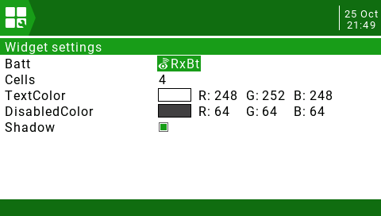

# OpenTX widgets

This is a collection of various widgets and telemetry for [OpenTX] and [EdgeTX]

## Requirements
The widgets have only been tested with OpenTX 2.3.14 and EdgeTX 2.6.0, older versions may not work.

## Installing
Go to the releases page and download the latest release and unzip to the root folder on your OpenTX SD card.

## Widgets and telemetry
- [GPS widget](#gps-widget-widgetsgpsmainlua)
- [HomeArrow widget](#homearrow-widget-widgetshomearrowmainlua)
- [AvgBatt widget](#avgbatt-widget-widgetsavgbattmainlua)
- [gps telemetry](#gps-telemetry-scriptstelemetrygpslua)
- [home telemetry](#home-telemetry-scriptstelemetryhomelua)

## GPS widget (WIDGETS/GPS/main.lua)
Display GPS coordinates in decimal degrees or [Plus code] in a widget.

### GPS widget settings

- `TextColor` The normal text color
- `DisabledColor` The text color when GPS is lost
- `TextSize` Size of text
  - `0` Auto size
  - `1` Small size
  - `2` Normal size
  - `3` Mid size
  - `4` Double size
  - `5` XXL size
- `Shadow` Show text shadow
- `PlusCode` Display PlusCode instead of decimal degrees

## HomeArrow widget (WIDGETS/HomeArrow/main.lua)

Displays distance and an arrow to the home position in a widget. Uses GPS telemetry to calculate distance and direction to home. The home position is initially set when the specified switch for armed is activated.

### HomeArrow widget settings

- `TextColor` The normal text color
- `DisabledColor` The text color when GPS is lost
- `Shadow` Show text shadow
- `Armed` Source for Armed switch. This must be positive value when armed. When this becomes active the current position is used as the home position.
- `ArmedReversed` Reverses the armed switch meaning. So when armed value becomes negative the current position is used as the home position.

## AvgBatt widget (WIDGETS/AvgBatt/main.lua)
Displays average battery cell voltage in a widget.

### AvgBatt widget settings

- `Batt` Telemetry source for the total battery value
- `Cells` Number of cells for battery
- `TextColor` The normal text color
- `DisabledColor` The text color when telemetry is lost
- `Shadow` Show text shadow

## gps telemetry (SCRIPTS/TELEMETRY/gps.lua)
Displays GPS coordinates in decimal degrees and [Plus code] in a telemetry full screen (FrSky Taranis only)

## home telemetry (SCRIPTS/TELEMETRY/home.lua)
Displays distance and an arrow to the home position in a telemetry full screen (FrSky Taranis only)

To change the switch to use for arming you can edit the `SCRIPTS/TELEMETRY/home.lua` file and change the following constants:

- ARMED_SWITCH
- ARMED_SWITCH_REVERSED

[OpenTX]: https://www.open-tx.org/
[EdgeTX]: https://github.com/EdgeTX/edgetx
[Plus code]: https://en.wikipedia.org/wiki/Open_Location_Code
