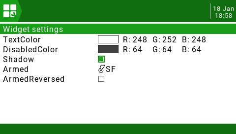

# OpenTX widgets

This is a collection of various widgets and telemetry for [OpenTX]

## Requirements
The widgets have only been tested with OpenTX 2.3.14, older versions may not work.

## Installing
Go to the releases page and download the latest release and unzip to the root folder on your OpenTX SD card.

## Widgets and telemetry
- [GPS widget](#gps-widget)
- [HomeArrow widget](#homearrow-widget)
- [AvgBatt widget](#avgbatt-widget)
- [gps telemetry](#gps-telemetry)
- [home telemetry](#home-telemetry)

## GPS widget
Display GPS coordinates in decimal degrees or [Plus code] in a widget.

### GPS widget settings

- `TextColor` The normal text color
- `DisabledColor` The text color when GPS is lost
- `TextSize` Size of text
  - `0` Auto size
  - `1` Small size
  - `2` Normal size
  - `3` Mid size
  - `4` Double size
  - `5` XXL size
- `Shadow` Show text shadow
- `PlusCode` Display PlusCode instead of decimal degrees

## HomeArrow widget

Displays distance and an arrow to the home position in a widget. Uses GPS telemetry to calculate distance and direction to home

### HomeArrow widget settings

- `TextColor` The normal text color
- `DisabledColor` The text color when GPS is lost
- `Shadow` Show text shadow
- `Armed` Source for Armed status. This must be positive value when armed. When this becomes active the current position is used as the home position.
- `Imperial` Display imperial values instead of metric

## AvgBatt widget
Displays average battery cell voltage in a widget.

### AvgBatt widget settings
- `Batt` Telemetry source for the total battery value
- `Cells` Number of cells for battery
- `TextColor` The normal text color
- `DisabledColor` The text color when telemetry is lost
- `Shadow` Show text shadow

## gps telemetry
Displays GPS coordinates in decimal degrees and [Plus code] in a telemetry screen (Taranis only)

## home telemetry
Displays distance and an arrow to the home position in a telemetry screen (Taranis only)

[OpenTX]: https://www.open-tx.org/
[Plus code]: https://en.wikipedia.org/wiki/Open_Location_Code
