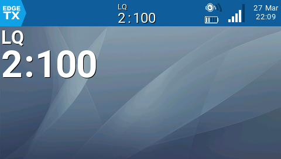
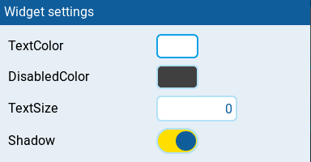
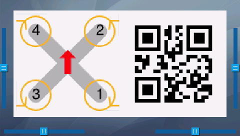
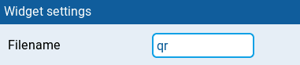
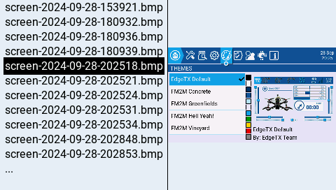

# EdgeTX/OpenTX widgets

This is a collection of various widgets, tools and telemetry for [EdgeTX] and some for [OpenTX]

## Requirements

The widgets have only been tested with EdgeTX 2.10.4 and OpenTX 2.3.14, older versions may not work.

## Installing

Go to the releases page and download the latest release and unzip to the root folder on your EdgeTX SD card.

## Widgets and telemetry

- [GPS widget](#gps-widget-widgetsgpsmainlua)
- [HomeArrow widget](#homearrow-widget-widgetshomearrowmainlua)
- [AvgBatt widget](#avgbatt-widget-widgetsavgbattmainlua)
- [CrsfLQ widget](#crsflq-widget-widgetscrsflqmainlua)
- [Image widget](#image-widget-widgetsimagemainlua)
- [Screenshot viewer tool](#screenshot-viewer-tool-scriptstoolsscreenshot-viewerlua)
- [gps telemetry](#gps-telemetry-scriptstelemetrygpslua)
- [home telemetry](#home-telemetry-scriptstelemetryhomelua)

## GPS widget (WIDGETS/GPS/main.lua)

Display GPS coordinates in decimal degrees or [Plus code] in a widget.

### GPS widget settings

- `TextColor` The normal text color
- `DisabledColor` The text color when GPS is lost
- `TextSize` Size of text
  - `0` Auto size
  - `1` Small size
  - `2` Normal size
  - `3` Mid size
  - `4` Double size
  - `5` XXL size
- `Shadow` Show text shadow
- `PlusCode` Display PlusCode instead of decimal degrees

## HomeArrow widget (WIDGETS/HomeArrow/main.lua)

Displays distance and an arrow to the home position in a widget. Uses GPS telemetry to calculate distance and direction to home. The home position is initially set when the specified switch for armed is activated.

### HomeArrow widget settings

- `TextColor` The normal text color
- `DisabledColor` The text color when GPS is lost
- `Shadow` Show text shadow
- `Armed` Source for Armed switch. This must be positive value when armed. When this becomes active the current position is used as the home position.
- `ArmedReversed` Reverses the armed switch meaning. So when armed value becomes negative the current position is used as the home position.

## AvgBatt widget (WIDGETS/AvgBatt/main.lua)

Displays average battery cell voltage in a widget.

### AvgBatt widget settings

- `Batt` Telemetry source for the total battery value
- `Cells` Number of cells for battery or 0 value for auto detection of cells
- `TextColor` The normal text color
- `DisabledColor` The text color when telemetry is lost
- `Shadow` Show text shadow

## CrsfLQ widget (WIDGETS/CrsfLQ/main.lua)

Displays [LQ] value for [Crossfire] link (Combined RFMD and RLQY).

### CrsfLQ widget settings

- `TextColor` The normal text color
- `DisabledColor` The text color when telemetry is lost
- `TextSize` Size of text
  - `0` Auto size
  - `1` Small size
  - `2` Normal size
  - `3` Mid size
  - `4` Double size
  - `5` XXL size
- `Shadow` Show text shadow

## Image widget (WIDGETS/Image/main.lua)

Displays an image in a widget (EdgeTX color screen only). This can be handy to display pilot QR code, flight instructions or any image you might need. Put the images (Formats: .jpg, .png or .bmp) in folder WIDGETS/Image/images, make sure the filename isn't longer than 8 characters. Go to settings for the image widget. It will autofill with the first filename in the images folder. Input the correct filename that you want to use in the `Filename` field. Input only the filename without the file extension. Try to make sure the images you use are not to large (480x272 is maximum size) otherwise there will be an out of memory error.

### Image widget settings

- `Filename` The filename of the image (no extension)

### Screenshot viewer tool (SCRIPTS/TOOLS/Screenshot viewer.lua)

The Screenshot viewer tool displays all available screenshots in a list and then a screenshot can be selected to display in a full screen. (EdgeTX color screen only)

## gps telemetry (SCRIPTS/TELEMETRY/gps.lua)

Displays GPS coordinates in decimal degrees and [Plus code] in a telemetry full screen (FrSky Taranis only)

## home telemetry (SCRIPTS/TELEMETRY/home.lua)

Displays distance and an arrow to the home position in a telemetry full screen (FrSky Taranis only)

To change the switch to use for arming you can edit the `SCRIPTS/TELEMETRY/home.lua` file and change the following constants:

- ARMED_SWITCH
- ARMED_SWITCH_REVERSED

[OpenTX]: https://www.open-tx.org/
[EdgeTX]: https://github.com/EdgeTX/edgetx
[Plus code]: https://en.wikipedia.org/wiki/Open_Location_Code
[LQ]: https://oscarliang.com/lq-rssi-tbs-crossfire/
[Crossfire]: https://www.team-blacksheep.com/products/prod:crossfire_tx
